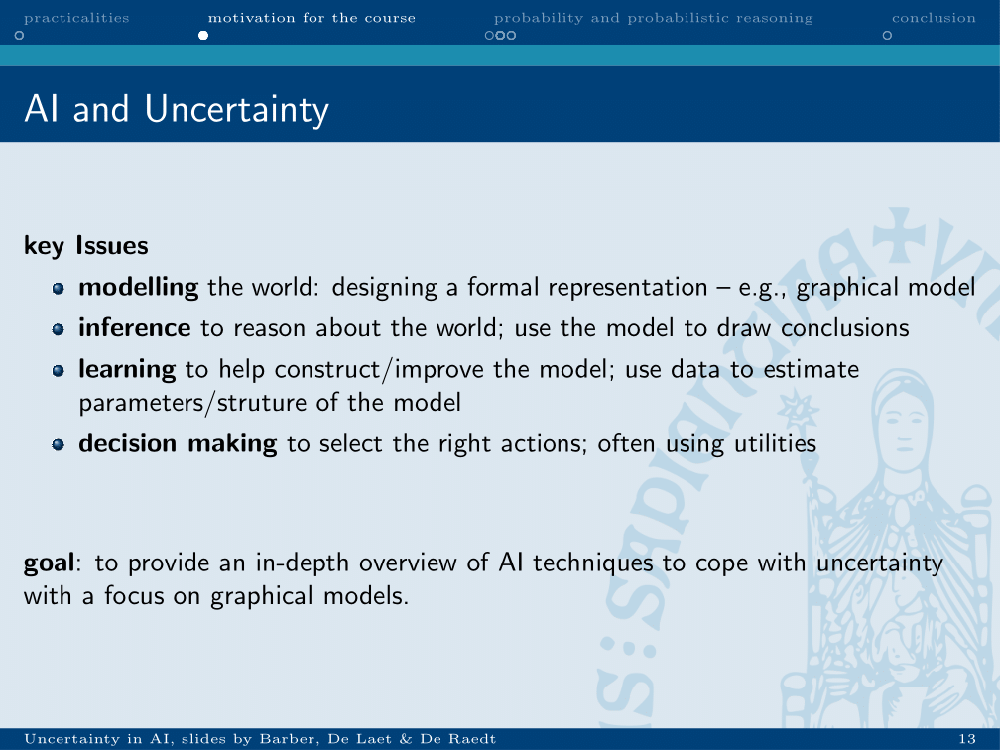
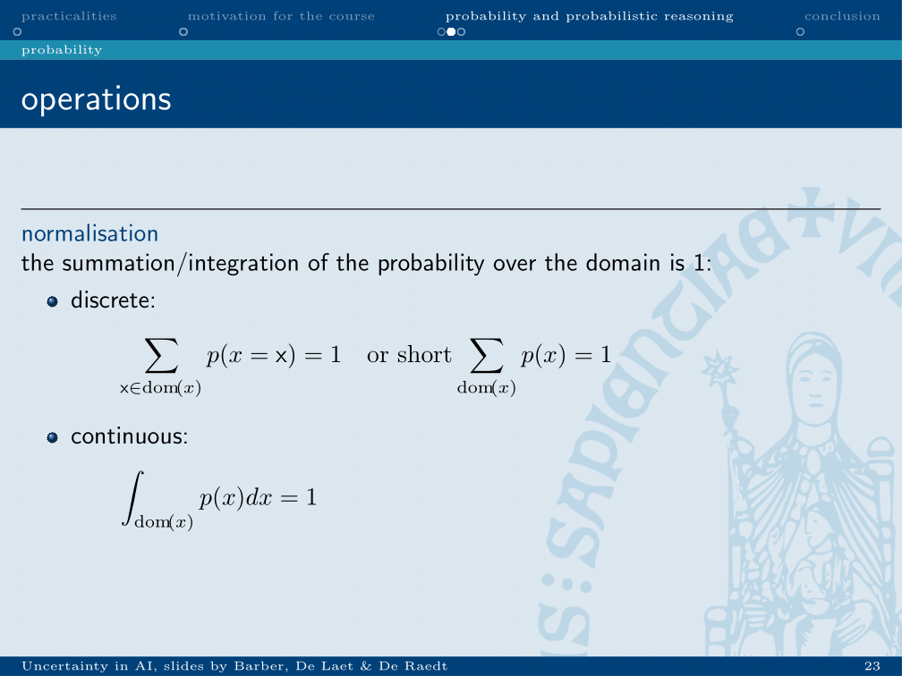
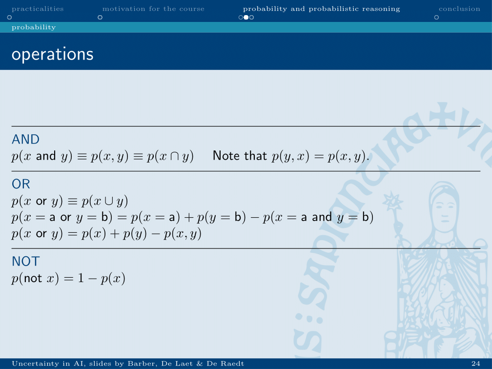
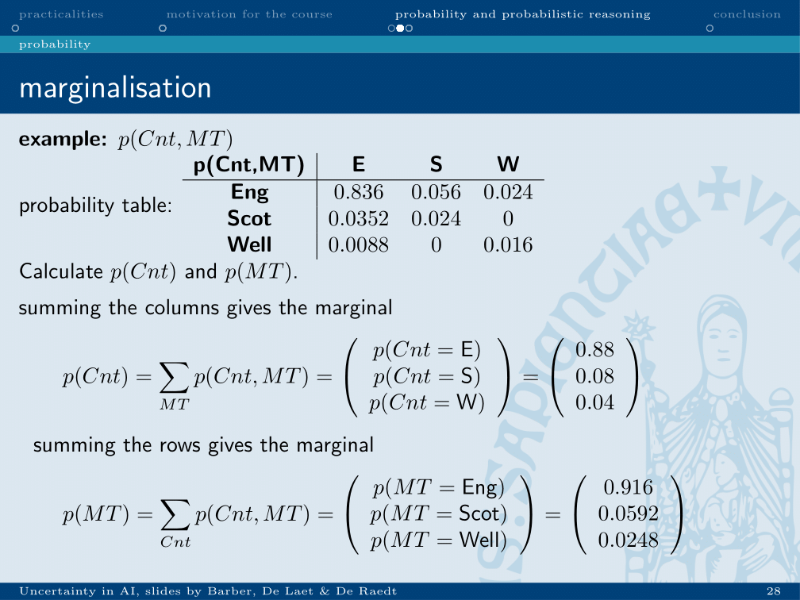
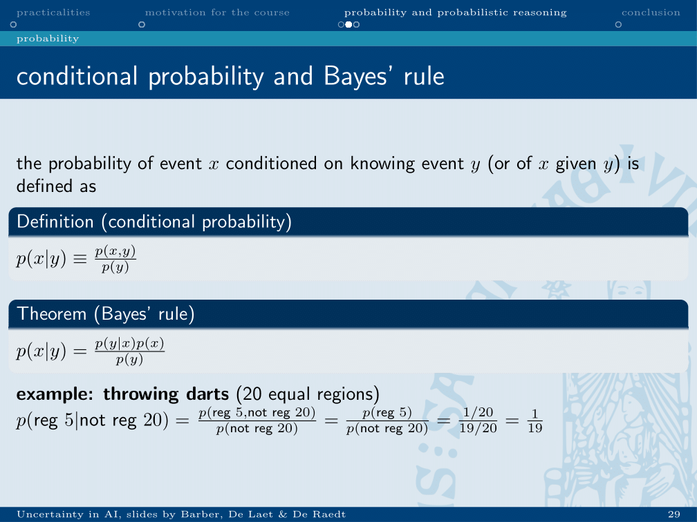
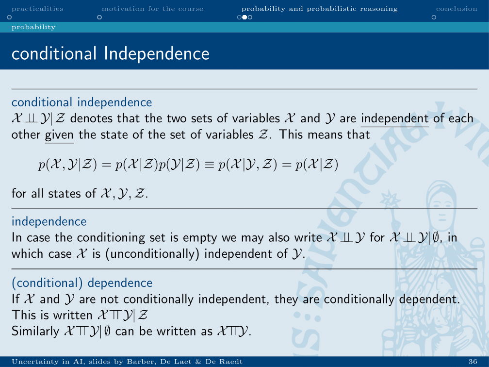
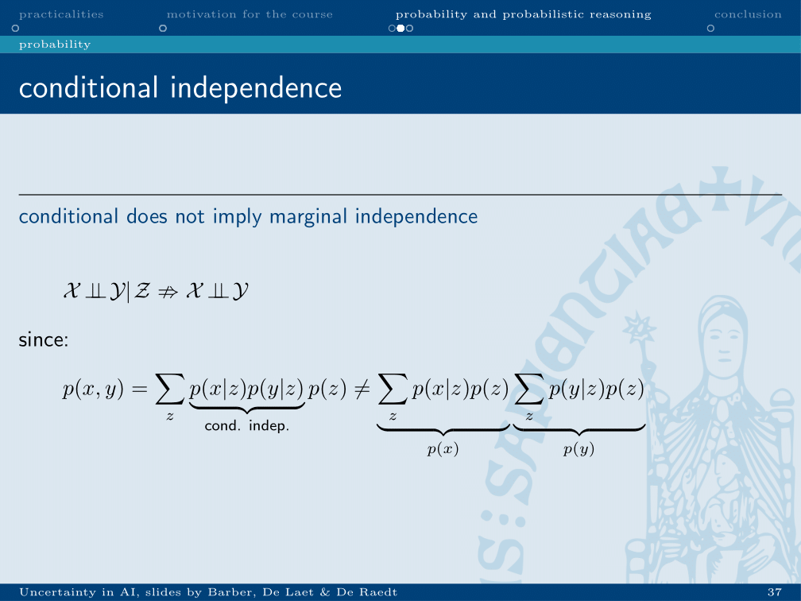
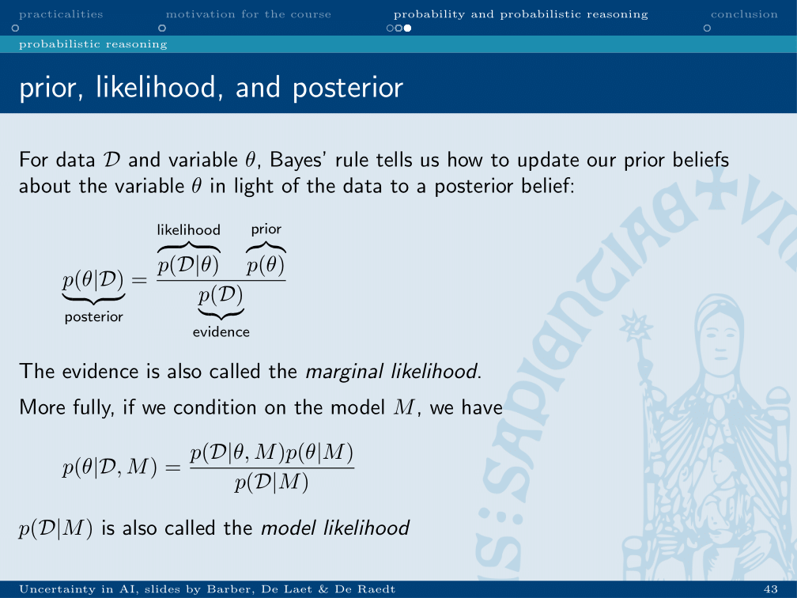

chapter_1
# Chapter 1: introduction and probability

### Goal of the course

* Modelling: a formal representation on how the world behaves.
* Inference: answer question about the world by evaluating the model.
* Learning: construct or improve the model on the world. Use data to improve structure or parameters of which the world consists.
* Decision making: draw conclusions from all of the above to use in the real world.

### Probability
#### Normalisation

If you look at a probability density function, either discrete or continuous, the sum over all of the possible options should be 1.

#### Rules of calculation with probability
Derived from set theory:

#### Marginalisation
When there are multiple dimensions x and y, the marginal over x is the sum of each option for x for every option of y.

### Bayes rule
If two probabilities are dependent, evidence on one will influence the probability of the other. This is formalised in Bayes rule:

#### Conditional dependence

When two sets of variables X and Y are conditionally independent, there exists a set of variables Z, given which the two sets are independent. These variables Z can be seen as “in between” X and Y in a Markov network, cutting them off from each other.

This does not mean that both variables X and Y can be marginalised over Z and will then be independent. 

### Usage in science
#### Prior, likelihood, posterior, evidence paradigm

This can be used to infer odds on parameters based on observations.
For instance, you can calculate the odds of a known parameter theta, based on new observations D.
#### Most probable posteriori

By using a MAP assignment, this can be used to infer the most probable parameter theta in the light of the data.

#bioinformatics/uai/summary