chapter_10

# Lecture 10: sampling techniques
## Basic sampling techniques
### Univariate sampling from discrete distributions
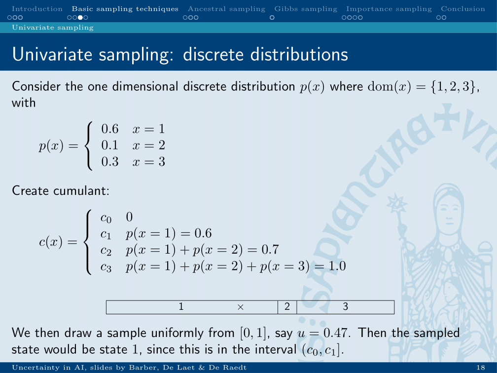
* Order the values by their probability
* Calculate cumulant up to each value
* When random number between last and next, this is the value.

### Univariate sampling from continuous distributions
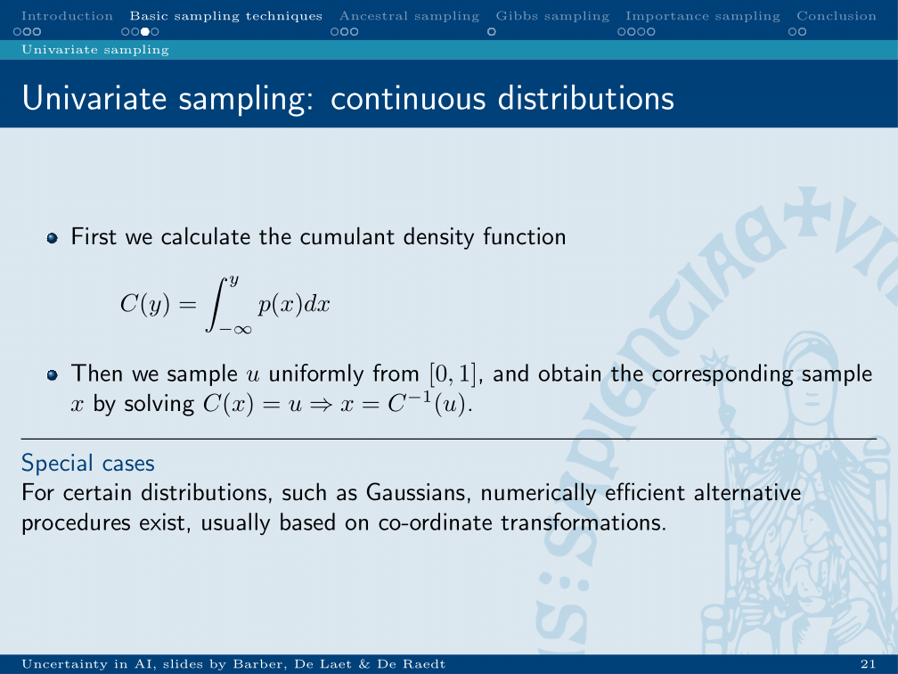
* Same principle for continuous distributions

### Rejection sampling
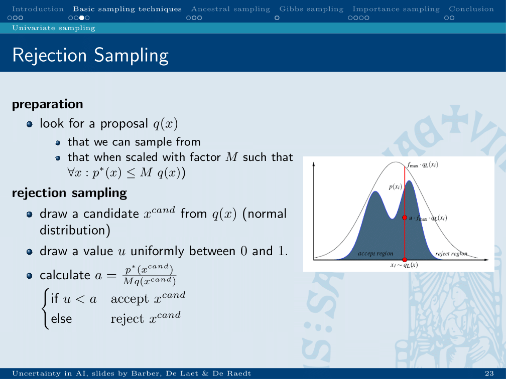
* Create proposal distribution close to real distribution: f(x)
* sample from it: x
* sample u between 0 and f(x)
* if u < real(x) -> take the sample
* otherwise reject
	* the more rejections, the less efficient.

## Multivariate sampling
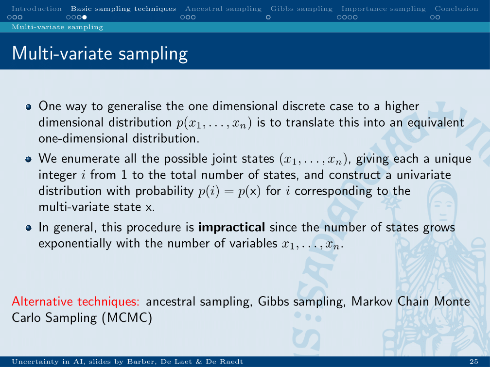
* Enumerate
* Add counts to options
* Draw from counts
-> not efficient -> this is why ancestral sampling exists.

### Ancestral sampling
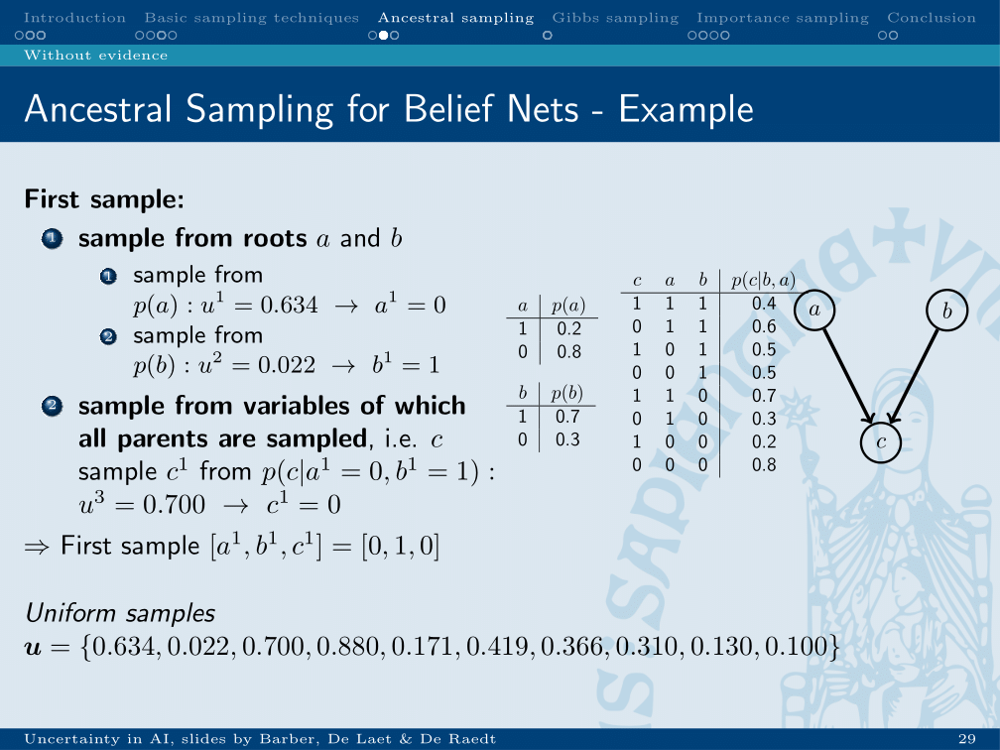
* Start at root, sampling from their distribution.
* Using this sample, sample from its children.
	* In case of evidence: throw away the sample if it doesn’t agree with evidence.
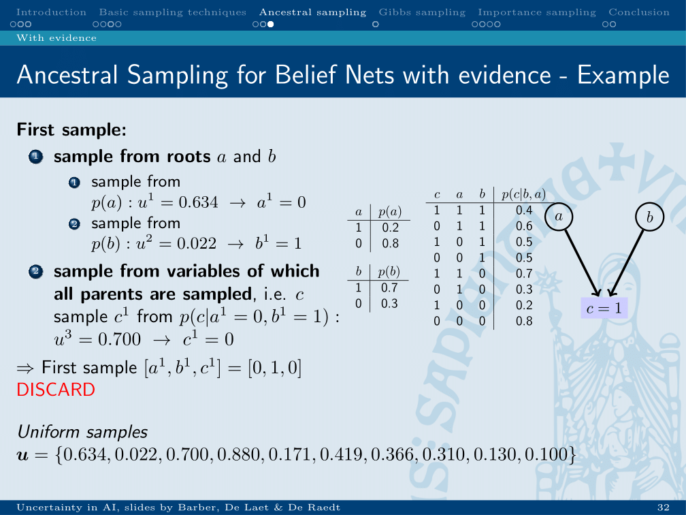
Example of throwing away a sample because of evidence.

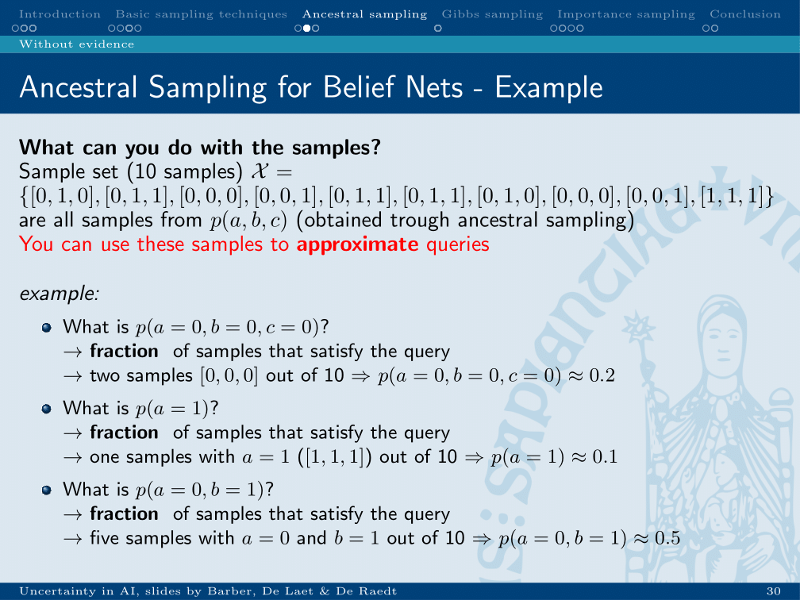
Using these samples, you can answer queries by counting or MAP.

## Gibs-sampling
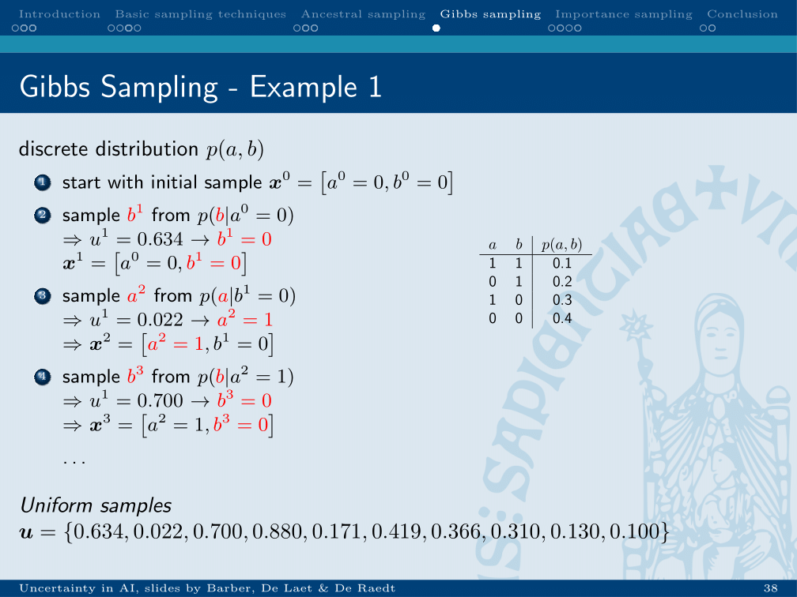
* Start with random sample
* Change one variable, conditional on others, with a random number

* This causes the samples to be dependent on previous samples:
	* Use burn in: start recording after k-samples
	* Only record every k’th sample
	* Risk of getting stuck at local minimum.

### Importance “sampling”
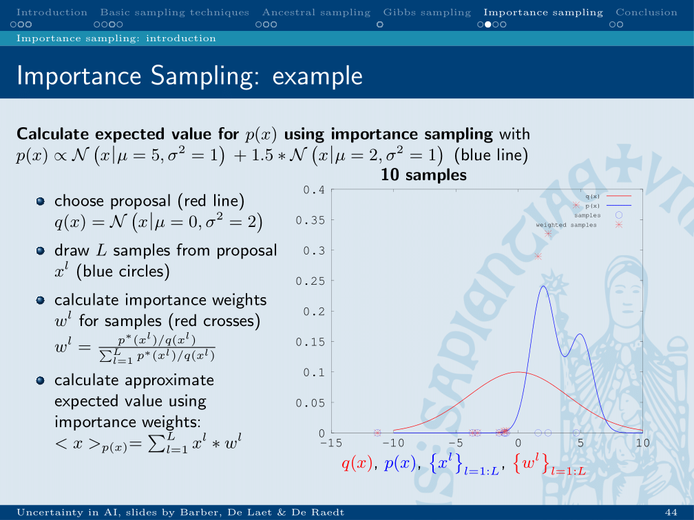
* Calculate weights to transform samples from one distribution into value of another distribution.
* <x>p(x) = sum(xl * wl)

## Particle filter
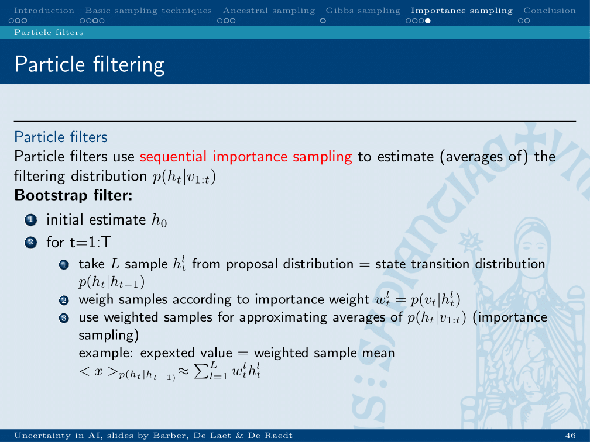
Above importance sampling is used in particle filters.

### Conclusion
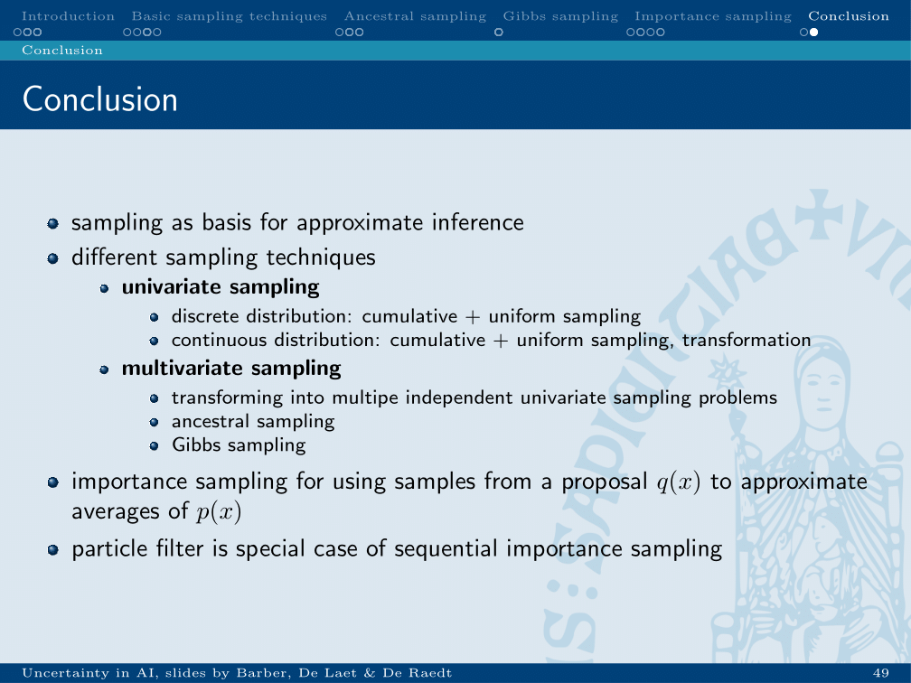

#bioinformatics/uai/summary