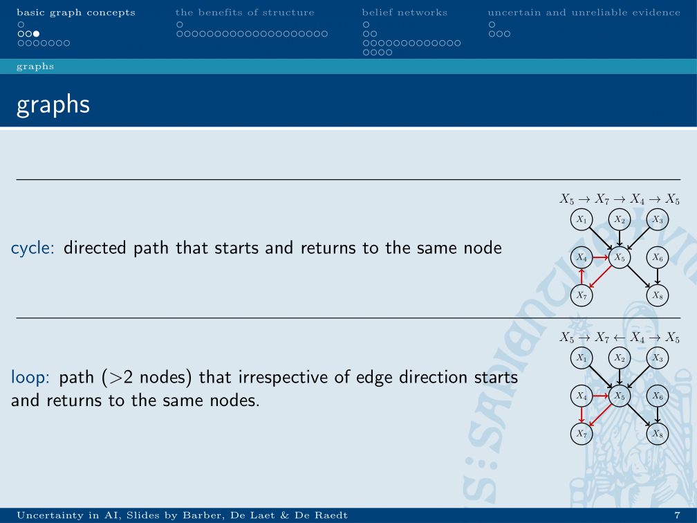
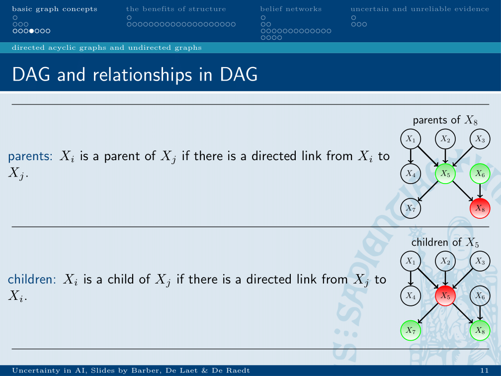
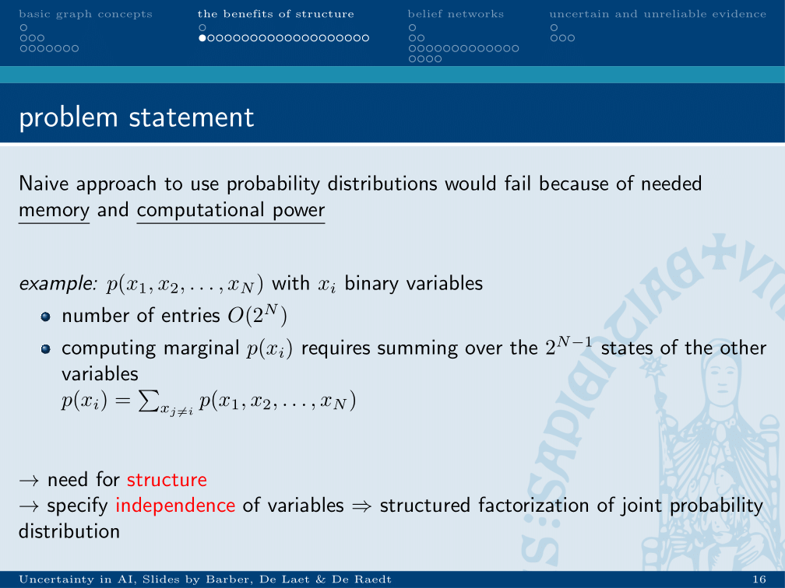

chapter_2
## Chapter 2: Introduction to graphs and Bayesian networks
### Introduction to graphs

#### Paths and directed paths.

A path is a set of edges which leads from a start node to an end node without respecting edge direction.
Directed path is a path which does respect edge direction.

#### Cycles and loops

Cycle respects edge direction, loop does not respect edge direction.

### Directed acyclic graphs
#### Definition

Subset of graphs. Acyclic graph -> without _cycles_.

#### Relationships within DAG’s

* Ancestor of Xi: set off nodes with a directed path to Xi.
* Descendants of Xi: set of nodes with a directed path leading to them from Xi.

* Parents: ancestor with single directed edge in path.
* Children: descendent with single directed edge in path.

* Neighbours of Xi: nodes directly connected to X, not holding into account edge direction.
* Clique: fully connected subset of nodes, not holding into account edge direction.
* Maximal clique: clique which cannot be extended by adding nodes.

* Connected graph: any node can be reached from any other node, without taking into account edge direction.
* Singly-connected graph: there is only one _path_ from any node a to any other node b: no loops.
* Multiply connected: inverse off a tree.

### Benefits of structure

The properties of DAG and conditional probability can be used to decrease computational load of queries. In a large network, calculating a query, like for instance calculating a marginal probability from a joint, will have great computational complexity. 
This is due to the great number of entries in a joint, which has an order of O(a^n) for a the number of options for each dimensions. A joint probability of 10 binary variables contains 1024 entries. Computing a marginal would require summation over 9^9 entries.

In a DAG, a joint probability can be factorised using Bayes rule. If you look at the number of entries in each of the coloured probability tables and add these up, it will be clear that this number is less than 2^5.

### Conditional independence in belief networks
To utilise these properties, it is important to know the rules of when two variables are dependent or independent given another variable.

If a variable in the evidence is in between two variables A and B, these variables are independent. _Except when it is a collider._ In (d), knowing C will mean that one option of B would have different probabilities for A than another option for B.

If variable in between is not in the evidence, this relation is inverted. This is clear from the visual graph:

Obviously, in (b) B is dependent on A, as there is a direct graph between them. In 

#bioinformatics/uai/summary

