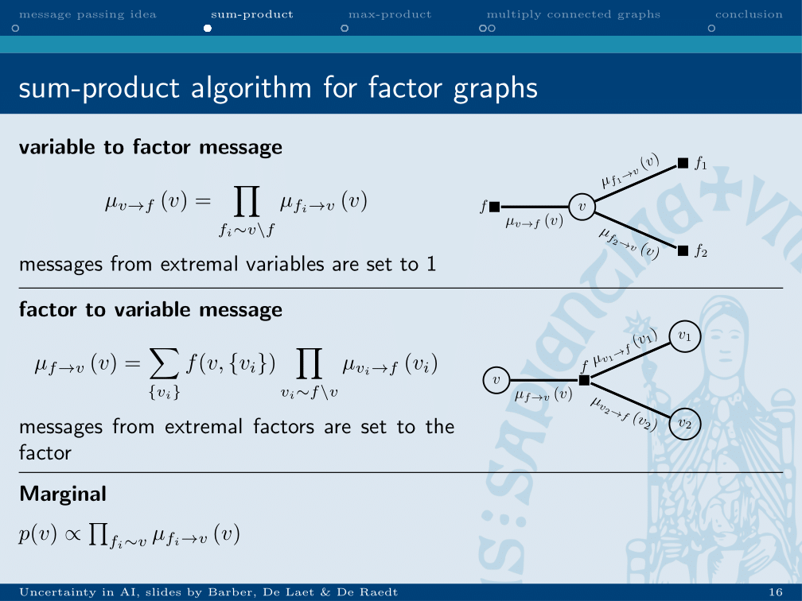

chapter_3

## Inference
### Sum product
Based on the idea of message passing

Variable from variable to factor is equal to the product of incoming messages.
Factor to variable message is equal to the sum of the products of the probability of a value given the incoming variable and the incoming message of that variable.

First, the leaves nodes are initialised to 1 and the leave factors to their values.
Order is picked, dependent on the factor which should be calculated. If only 1 marginal need to be calculated, chose this one as the root node.