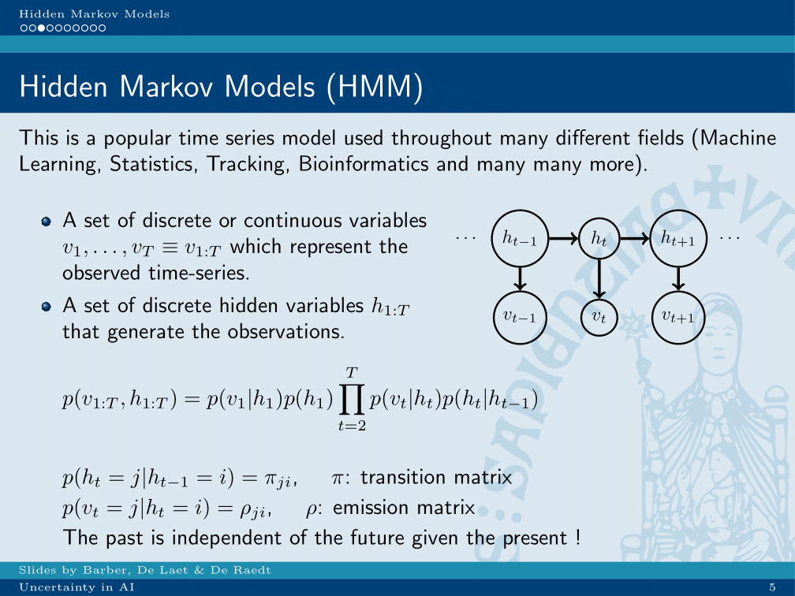

chapter_3

# Lecture 3: Bayesian networks, conditional independence, D-seperation

## Connection graph
Shows wether two variables are dependent on each other, by drawing a graph between them.
Method for constructing them:

Keep links with colliders in the conditioning set.
Cut links with colliders not in the conditioning set.

Cut links with with non-colliders in the conditioning set.
Keep links with non-colliders not in the conditioning set.
Paths between variables means dependence.

### Markov equivalence

Same skeleton and same set of immortalities -> same conditional independence statements.

## Uncertain evidence

Uncertain evidence will influence probability of dependent variables, but only as much as relative to their certainty.

## Hidden Markov models

There is a true state, which influence the probability of finding something in a certain measurement. This true state also influences the consecutive states.

### Inference questions on HMM’s
On these models, some important special queries can be done:

* Filtering: what is the probability a current state, given all previous observations.
* Smoothing: what is the probability of a state in the past, given all observations up until now.
* Viterbi: what is the most probable path of all hidden states until now given the complete evidence.

#bioinformatics/uai/summary