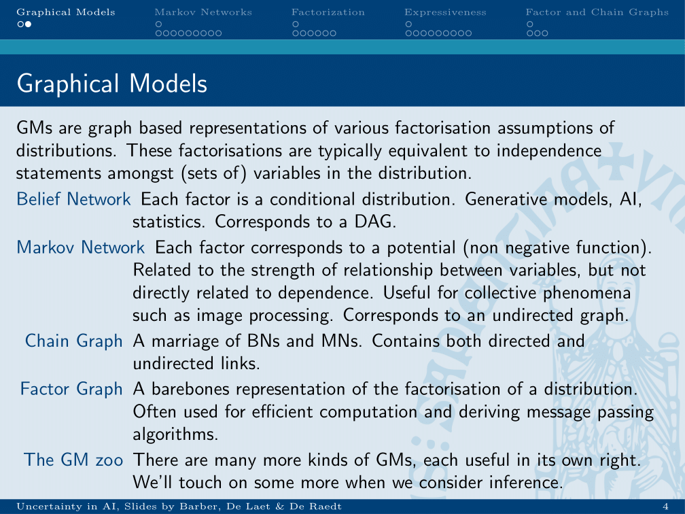
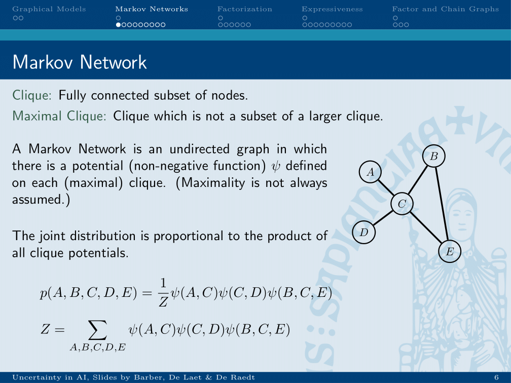
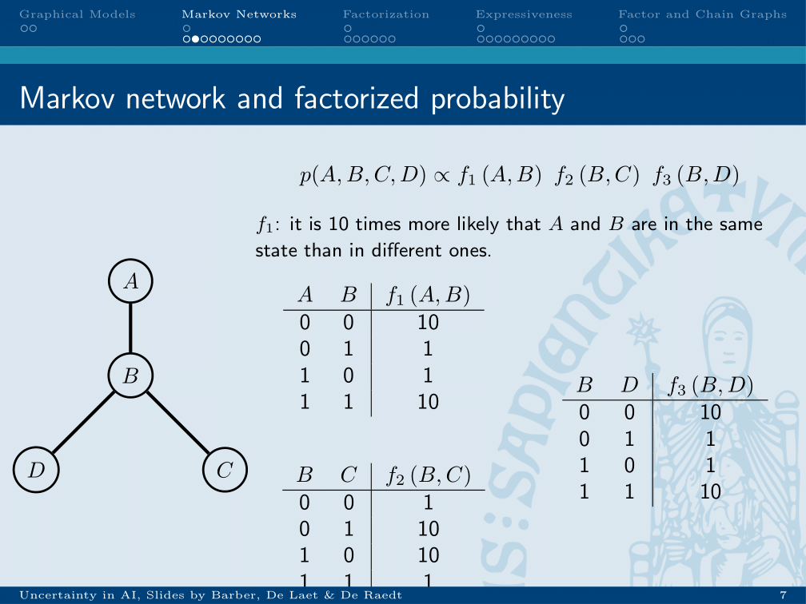
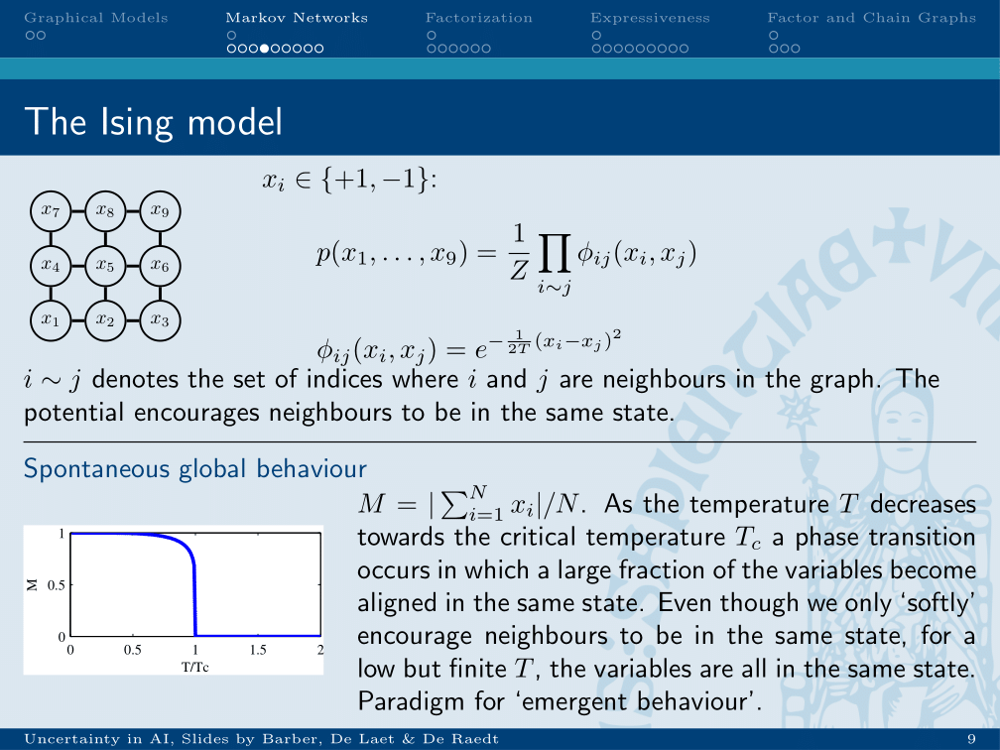
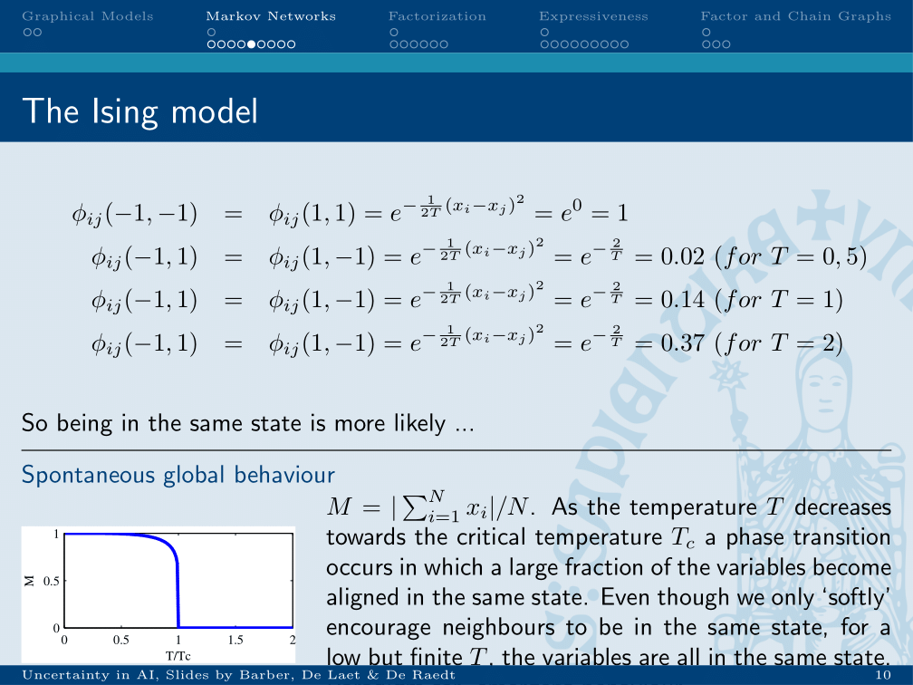
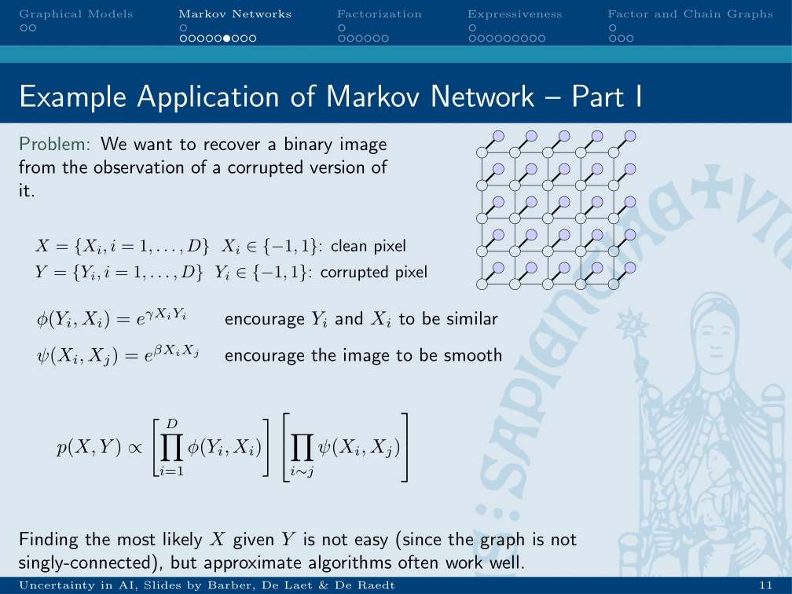
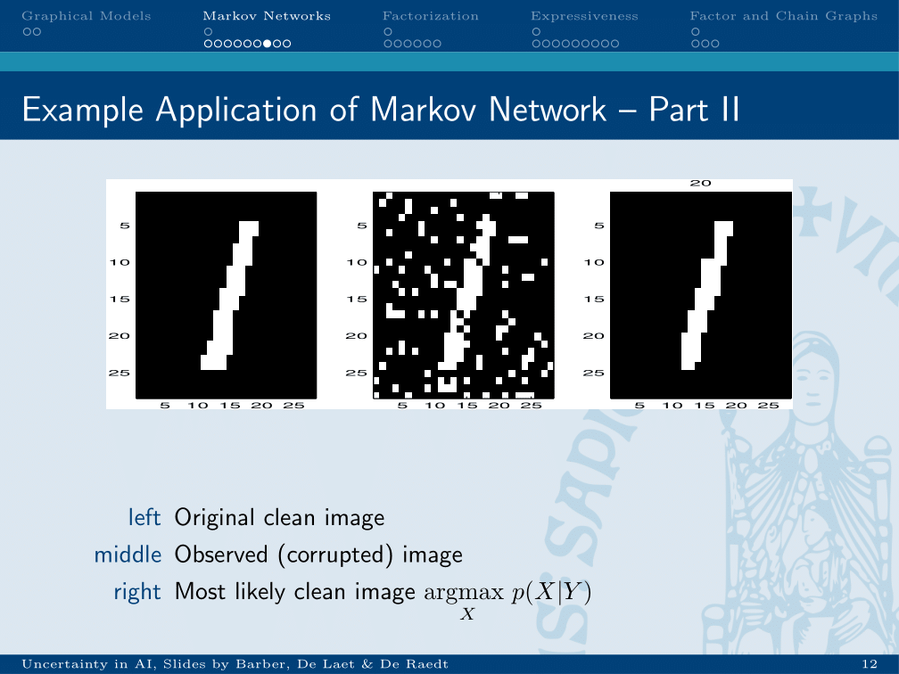
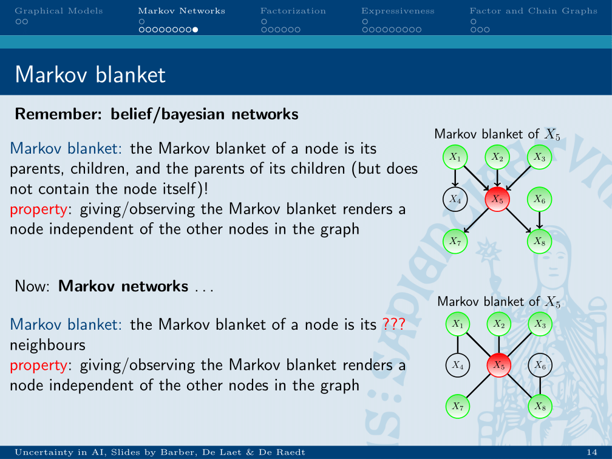

chapter_4

# Lecture 4: Markov Nets, (in)dependence graphs
## Different graphical models

There exist many different kinds of graphical models. Not all can be used to expressed the same semantics. Some specific, potentially efficient inference methods can be used on some and not on others. This determines the choice for a graphical model.

## Potentials

In a Markov network, a potential psi is defined for cliques. These psi’s are proportional to the joint distribution, therefore the psi’s do not need to be normalised and their sum can be larger than 1.

### Partition function

The normalisation constant (partition function) is calculated by dividing 1 by the sum of all possible potentials. Each potential consisting of the product of all clique potentials for that possible set off variables.
* enumerate all possible assignments for all variables
	* calculate potential each clique for this assignment
	* take product of each potential
* sum all of these, take inverse

An example of the psi functions.

## Application of Markov networks
### The Ising model

This kind of model is applied in the Ising model. Nodes are in a grid and can have a value of either 1 or -1. 

### Potentials within the Ising model

* Example for the behaviour of different states within an Ising model
* Similar values will get an exponent of 0 and therefore a potential of 1.
* Different values will get an exponent of -2/T, therefore it will go small for low T and large for high T -> more chaos at higher temperature.

### Hidden Markov networks

* X is the real world, where “pixels” which are closer together should be more likely to be similar, as the world is smooth.
* Y are our measurements, the actual pixels. If we encourage X and Y to be similar, our image will be more like the measurement we took.

* Given this network, we can infer what the most likely state of the (smooth) real world is, given our noisy measurement.

## Markov blanket

* Markov blanket of a node are all nodes the cliques in which it is involved and for which a potential is generated.
* In a hidden Markov network:
	* a pixel is only dependent on the part of the real world it is trying to capture
	* a part of the real world is dependent on all connected parts of the real word and the pixel trying to capture it.

#bioinformatics/uai/summary