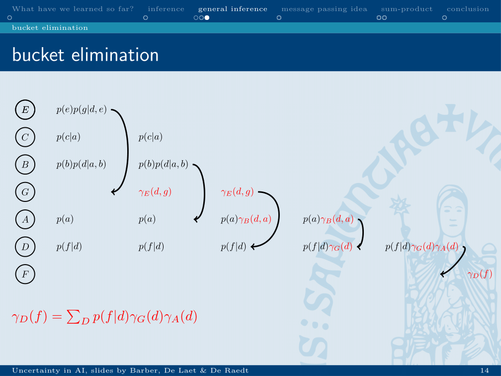

chapter_5

# Lecture 5: Inference
## Basic principle of inference

* Answering questions about the environment, using the distribution.

* There exist many methods to perform inference. These exist as it can be expensive to perform inference and every method is optimised for some type of question and model.

### Variable elimination
* An example of where large decreases in computation time can be obtained, is in variable elimination. 
* This can be done when a marginal over variables is calculated.

* In this slide a random order is chosen. 
* Because of this, every summation still needs to be calculated. 
* If a smarter order is picked, this could be optimised, as in the following example.

* In this example, an optimal order is picked. 
* This leads to three marginals becoming zero and not having to be calculated.
* But how to chose this order? -> begin with the leaves.

## Bucket elimination
_A graphical method for calculating marginals which represents “pushing summations inside_

* Move down the buckets, at each step performing the summation over the variable in that bucket.
* This can be done either with variable names or actual probabilities from the tables.
* Dependent on the network properties and the chosen ordering, this can be efficient.

## Message passing
_Message passing lies at the basis of many techniques to calculate marginals._

* Factorise the joint
* Query: marginal probability of p(a=0)
* Write down the formula for this query
* Push summations inside, by doing this you will decrease the needed summations.

In the example, the number of summations is decreased from 7 to 5.

### Application on Markov chains

Will leed to 2T-1 needed summations if the order is perfect, linear increase instead of exponential!

## Sum product
Based on the idea of message passing

Variable from variable to factor is equal to the product of incoming messages.
Factor to variable message is equal to the sum of the products of the probability of a value given the incoming variable and the incoming message of that variable.

First, the leaves nodes are initialised to 1 and the leave factors to their values.
Order is picked, dependent on the factor which should be calculated. If only 1 marginal need to be calculated, chose this one as the root node.

#bioinformatics/uai/summary