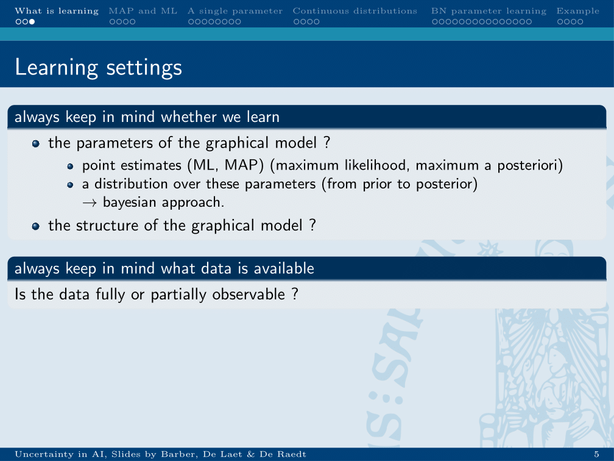
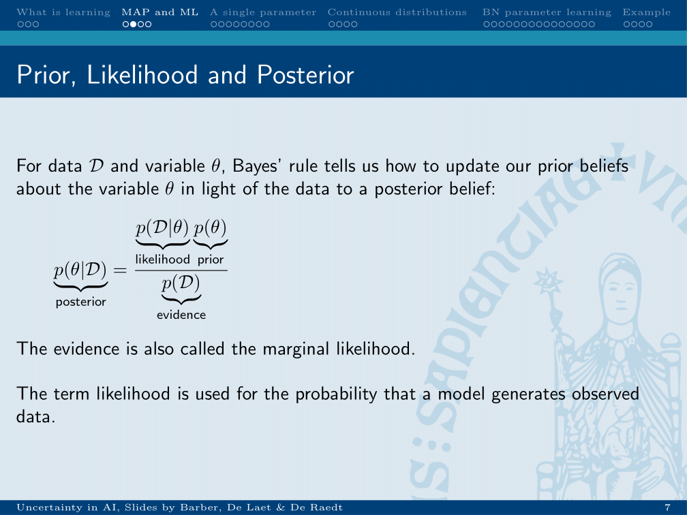
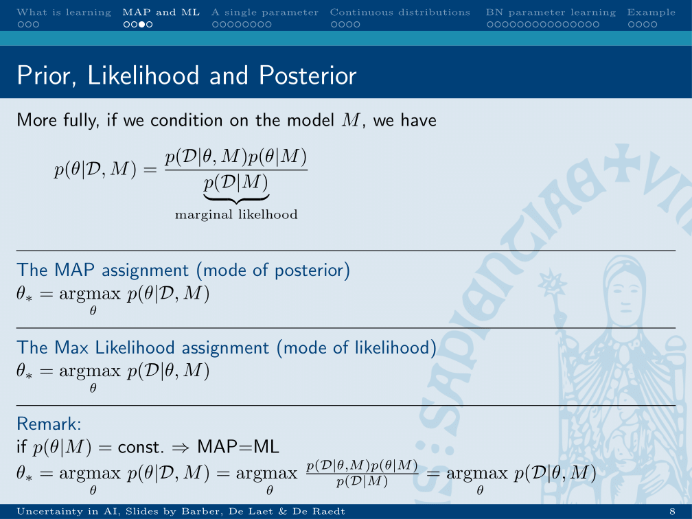
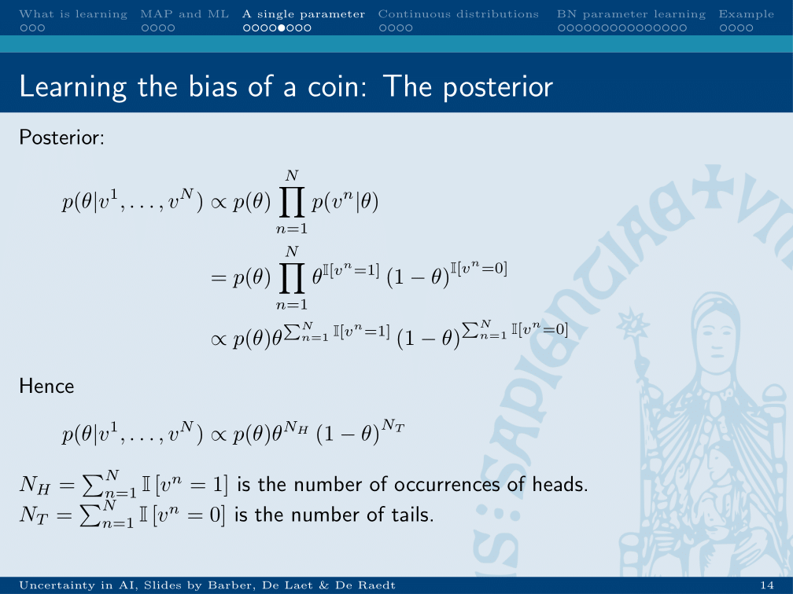
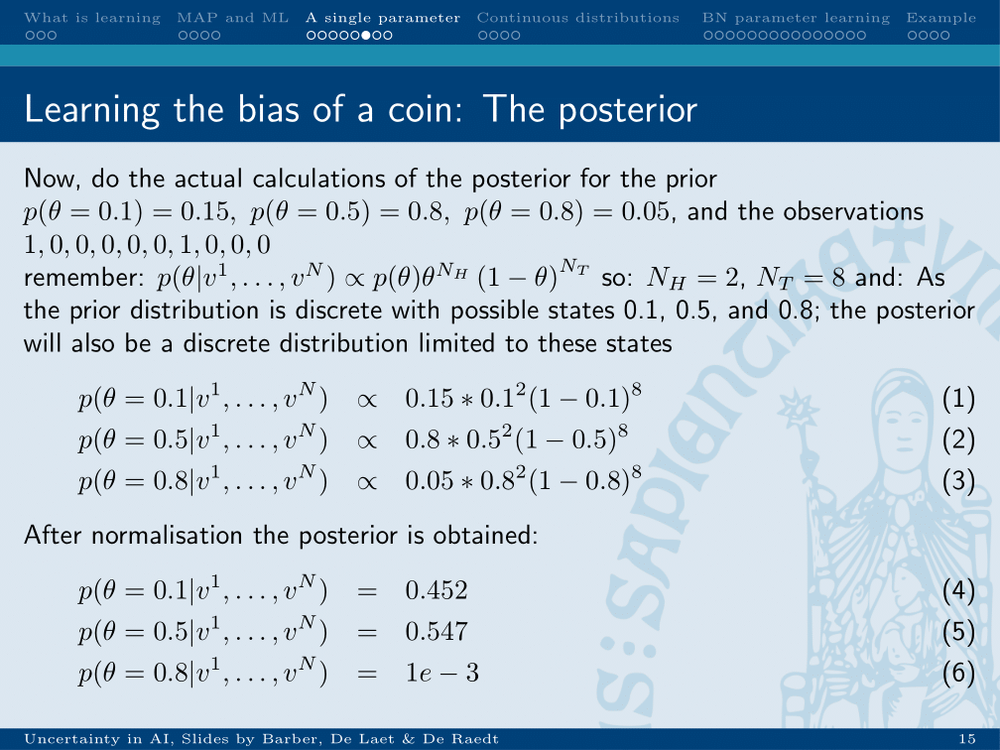

chapter_7

# Lecture 7: learning from fully observable data
## Bayesian vs. frequentist

* Bayesian has a belief and updates it in light of the evidence
* Frequentist makes one point estimate.

## Bayesian approach

* The chance of the variable theta given the evidence is equal to the probability of the data given the variable, times the odds of the variable (prior), divided by the probability over the data.

## MAP and ML in Bayesian approach

* The MAP is the assignment of theta for which the probability of theta given the data and the model is the largest.
* The ML is the assignment of theta for which the probability of the data given theta and the model is the largest.

### 

* The posterior can be calculated by multiplying the probability of theta by the probability of the evidence given theta, divided by the probability of the data.

In practice, this results in the following calculation.

## Calculating ML
* theta for which the evidence is the most likely given theta: counting

## Bayes estimate
theta_bayes_ is the mean of the posterior. Calculated by integrating over the posterior.

## Calculating MAP from beta distribution

This formula is derived by differentiating the expression p(D|theta)*p(theta) and setting equal to zero, therefore giving the theta for which the posterior is maximal.

#bioinformatics/uai/summary